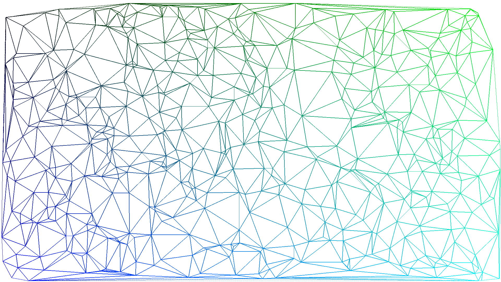

# rs_DeWall

A simple implementation of delauny triangulation based on ["DeWall: A fast divide and conquer Delaunay triangulation algorithm in E^d" from Cignoni et al. (1998)](http://vcg.isti.cnr.it/publications/papers/dewall.pdf)



## Usage
Build with `cargo --release`, otherwise the programm will take minutes instead of seconds.

## Algorithm
The following pseudocode was taken from the original paper as a basis for the implementation:
```
Function DeWall ( (P: pointset , AFL: (d-1)_face_list): d_simplex_list )

  f: (d-1) face
  AFL_alpha, AFL1, AFL2: d_face_list
  t: d-simplex
  sigma: d_simplex_list
  alpha: splitting_plane

  begin
    AFL_alpha, AFL_1, AFL_2 = empty_face_list
    Pointset_Partition (P, alpha, P1, P2)
  
    //Simplex Wall Construction
    if AFL.empty
      t = MakeFirstSimplex(P, alpha)
      AFL = (d-1)faces (t)
      Insert(t, sigma)
    
    for f in AFL
      if IsIntersected(f, alpha)
        Insert(f, AFL_alpha)
      if Vertices(f) in P1
        Insert(f, AFL_1)
      if Vertices(f) in P2
        Insert(f, AFL_2)

     while not AFL.empty()
       f = Extract(AFL_sigma)
       t = MakeSimplex(f,P)
       
       if t != null
          sigma += t
          
          for f' in (d-1)faces(t) and f != f'
      	    if IsIntersected(f', alpha)
              Insert(f', AFL_alpha)
            if Vertices(f') in P1
              Insert(f', AFL_1)
            if Vertices(f') in P2
              Insert(f', AFL_2)

     if not AFL_1.empty()
       sigma+=DeWall(P1, AFL_1)
     if not AFL_2.empty()
       sigma+=DeWall(P1, AFL_2)
    
     DeWall = sigma
  end

fn Update (f: face, L: face_list)
  if Member(f, L)
    Delete(f, L)
  else
    Insert(f, L)
```

## TODO
 - Use k-d-trees or other acceleration structures
 - Threading for the recursion steps
 - Clean outputs
 - Stepwise generation gif
 - Switch to an existing math library